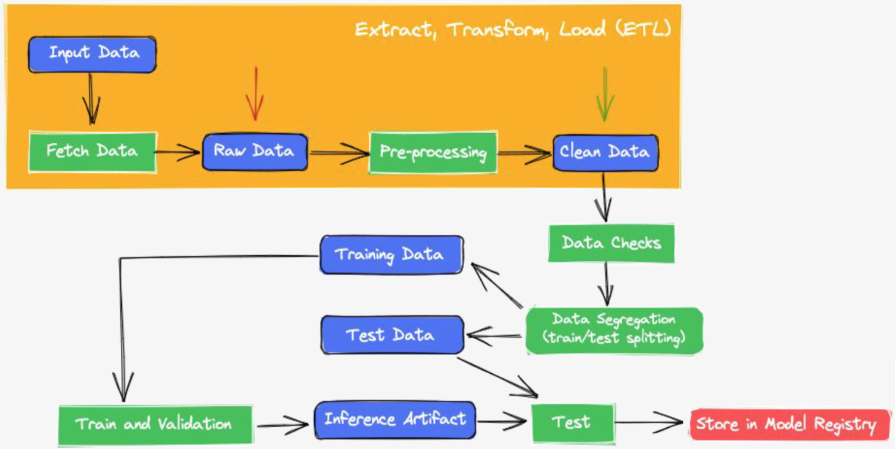
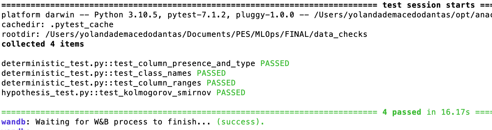

# Modelagem de dados do Airbnb com aplicação de MLOps



Este projeto está sendo desenvolvido como atividade prática na disciplina [IMD1123](https://github.com/ivanovitchm/mlops) (Tópicos Especiais em Inteligência Computacional / MLOps) e visa implementar um pipeline de MLOps para modelagem preditiva de preços de imóveis do Rio de Janeiro anunciados no Airbnb (dez/2021). [Link para download do dataset](http://data.insideairbnb.com/brazil/rj/rio-de-janeiro/2021-12-24/data/listings.csv.gz)

As seguintes etapas serāo desenvolvidas:
- Fetch Data :heavy_check_mark:
- Pre-processing :heavy_check_mark:
- Data Checks :heavy_check_mark:
- Data Segregation (train/test splitting) :heavy_check_mark:
- Train and validation :small_red_triangle:
- Test 
- Store in Model Registry 

## Requisitos

`conda 4.8.2 | Python 3.7 ou maior`
`Weights & Biases`

Aqui utilizamos fortemente a ferramenta [wandb](https://wandb.ai/site) para acompanhar o versionamento e os artefatos gerados em cada etapa do pipeline.


## Instalação

Certifique-se que você está na pasta que contém o arquivo environment.yml quando for executar o comando no terminal.

Crie o ambiente do projeto:
```
conda env create -f environment.yml
```

Ative o ambiente criado:
```
conda activate mlops
```

## Passo-a-passo

### 1- Análise exploratória de dados no jupyterlab

Na pasta *EDA*, realizamos o download do banco que será armazenado na forma de artefato row_data.csv no wand, além de executarmos várias análises, através de um notebook, para conhecer melhor os dados trabalhados. Basta executar o comando informado no arquivo README.

```
mlflow run .
```

### 2- Pré-processamento

Na pasta *preprocessing*, é realizada a limpeza dos dados conforme a análise realizada no passo anterior. Para criar o artefato de dados limpos, basta acessar a pasta com os arquivos e executar o comando no terminal.

```bash
mlflow run . -P input_artifact="week_08_eda/raw_data.csv:latest" \
             -P artifact_name="preprocessed_data.csv" \
             -P artifact_type="clean_data" \
             -P artifact_description="Data after preprocessing"\
             -P project_name="week_08_preprocessing"
```

### 3- Segregação dos dados

Na pasta *data_segregation*, realizamos a divisão do nosso banco em treinamento e teste. Com a execução do comando abaixo, teremos 30% dos nossos dados separados para teste e o restante para treinamento. Note a importância de manter a nomenclatura escolhida para os artefatos, uma vez que, ao longo do pipeline, um artefato anterior é chamado para a criação do artefato que será utilizado na etapa seguinte.

```bash
mlflow run . -P input_artifact="week_08_preprocessing/preprocessed_data.csv:latest" \
             -P artifact_root="data" \
             -P artifact_type="trainvaltest_data" \
             -P test_size=0.3 \
             -P stratify="price" \
             -P random_state="13"
```

### 4- Checagem dos dados

Na pasta *data_checks*, realizamos testes determinísticos e não-determinísticos sobre nosso dado processado, para checar se ele cumpre os requisitos esperados antes de iniciarmos a modelagem.

```bash
mlflow run . -P reference_artifact="week_08_data_segregation/train_data.csv:latest" \
             -P sample_artifact="week_08_data_segregation/test_data.csv:latest" \
             -P ks_alpha=0.05 \
```

O resultado esperado após essa etapa é ilustrado na figura abaixo.
<center></center>
